# python_labs
# Лабораторная работа 7
## Задаание А 
```import pytest
from src.lib.text import normalize, tokenize, count_freq, top_n
import sys
import os

sys.path.insert(0, os.path.join(os.path.dirname(__file__), ".."))


@pytest.mark.parametrize(
    "source, expected",
    [
        ("ПрИвЕт\nМИр\t", "привет мир"),
        ("ёжик, Ёлка", "ежик, елка"),
        ("Hello\r\nWorld", "hello world"),
        ("  двойные   пробелы  ", "двойные пробелы"),
        ("", ""),
    ],
)
def test_normalize_basic(source, expected):
    assert normalize(source) == expected


@pytest.mark.parametrize(
    "text, expected",
    [
        ("привет мир", ["привет", "мир"]),
        ("hello,world!!!", ["hello", "world"]),
        ("по-настоящему круто", ["по-настоящему", "круто"]),
        ("2025 год", ["2025", "год"]),
        ("emoji 😀 не слово", ["emoji", "не", "слово"]),
        ("", []),
    ],
)
def test_tokenize_basic(text, expected):
    assert tokenize(text) == expected


def test_count_freq_and_top_n():
    tokens = ["a", "b", "a", "c", "b", "a"]
    freq = count_freq(tokens)
    assert freq == {"a": 3, "b": 2, "c": 1}
    assert top_n(freq, 2) == [("a", 3), ("b", 2)]


def test_top_n_tie_breaker():
    tokens = ["bb", "aa", "bb", "aa", "cc"]
    freq = count_freq(tokens)
    assert top_n(freq, 2) == [("aa", 2), ("bb", 2)]


def test_count_freq_empty_tokens():
    assert count_freq([]) == {}


def test_top_n_empty_freq():
    assert top_n({}, 5) == []
```
## Задание В 
``` import pytest
import csv
import json
from pathlib import Path
from src.lab05.json_csv import json_to_csv, csv_to_json


def test_json_to_csv_roundtrip(tmp_path: Path):
    src = tmp_path / "people.json"
    dst = tmp_path / "people.csv"
    data = [
        {"name": "Alice", "age": 22},
        {"name": "Bob", "age": 25},
    ]
    src.write_text(
        json.dumps(data, ensure_ascii=False, indent=2),
        encoding="utf-8",
    )
    json_to_csv(str(src), str(dst))

    with dst.open(encoding="utf-8", newline="") as f:
        rows = list(csv.DictReader(f))

    assert len(rows) == len(data)
    assert {"name", "age"} <= set(rows[0].keys())


def test_csv_to_json_roundtrip(tmp_path: Path):
    src = tmp_path / "people.csv"
    dst = tmp_path / "people.json"
    rows = [
        {"name": "Alice", "age": "22"},
        {"name": "Bob", "age": "25"},
    ]
    with src.open("w", encoding="utf-8", newline="") as f:
        writer = csv.DictWriter(f, fieldnames=["name", "age"])
        writer.writeheader()
        writer.writerows(rows)

    csv_to_json(str(src), str(dst))
    data = json.loads(dst.read_text(encoding="utf-8"))

    assert len(data) == len(rows)
    assert set(data[0].keys()) == {"name", "age"}


def test_json_to_csv_raises_value_error(tmp_path: Path):
    src = tmp_path / "empty.json"
    dst = tmp_path / "out.csv"

    src.write_text("[]", encoding="utf-8")

    with pytest.raises(ValueError):
        json_to_csv(str(src), str(dst))


def test_csv_to_json_raises_value_error(tmp_path: Path):
    src = tmp_path / "empty.csv"
    dst = tmp_path / "out.json"

    src.write_text("", encoding="utf-8")

    with pytest.raises(ValueError):
        csv_to_json(str(src), str(dst))


def test_json_to_csv_raises_file_not_found_error():
    with pytest.raises(FileNotFoundError):
        json_to_csv("111.json", "out.csv")


def test_csv_to_json_raises_file_not_found_error():
    with pytest.raises(FileNotFoundError):
        csv_to_json("1111.csv", "out.json")
 ```
 ### Что выводят эти два кода:
 


### Функция **black .**:
 
# Лабораторная работа 6
1. **cli_text.py** — утилиты для работы с текстом (cat и stats)
2. **cli_convert.py** — конвертеры данных (JSON/CSV/XLSX)
## Модуль cli_text.py

### Команда `cat`

Выводит содержимое файла построчно с опциональной нумерацией строк.

**Синтаксис:**
```bash
python -m src.lab06.cli_text cat --input <путь> [-n]
```

**Параметры:**
- `--input` (обязательный) — путь к входному файлу
- `-n` (опциональный) — нумеровать строки

**Примеры:**
```bash
# Вывод файла без нумерации
python -m src.lab06.cli_text cat --input data/samples/people.csv

# Вывод файла с нумерацией строк
python -m src.lab06.cli_text cat --input data/samples/people.csv -n
```

**Пример вывода:**
```
     1	name,age,city
     2	Alice,22,SPB
     3	Bob,25,Moscow
```

### Команда `stats`

Анализирует частоты слов в тексте и выводит статистику.

**Синтаксис:**
```bash
python -m src.lab06.cli_text stats --input <путь> [--top N]
```

**Параметры:**
- `--input` (обязательный) — путь к текстовому файлу
- `--top` (опциональный) — количество топ-слов для вывода (по умолчанию 5)

**Примеры:**
```bash
# Анализ с топ-5 словами (по умолчанию)
python -m src.lab06.cli_text stats --input data/samples/people.txt

# Анализ с топ-10 словами
python -m src.lab06.cli_text stats --input data/samples/people.txt --top 10
```

**Пример вывода:**
```
Всего слов: 15
Уникальных слов: 8
Топ-5:
  привет: 3
  мир: 2
  это: 2
  тест: 1
  текст: 1
```

## Модуль cli_convert.py

### Команда `json_csv`

Конвертирует JSON-файл в CSV формат.

**Синтаксис:**
```bash
python -m src.lab06.cli_convert json2csv --in <входной_файл> --out <выходной_файл>
```

**Параметры:**
- `--in` (обязательный) — путь к входному JSON файлу
- `--out` (обязательный) — путь к выходному CSV файлу

**Пример:**
```bash
python -m src.lab06.cli_convert json2csv --in data/samples/people.json --out data/out/people.csv
```

**Пример вывода:**
```
Успешно: data/samples/people.json → data/out/people.csv
```

### Команда `csv_json`

Конвертирует CSV-файл в JSON формат.

**Синтаксис:**
```bash
python -m src.lab06.cli_convert csv2json --in <входной_файл> --out <выходной_файл>
```

**Параметры:**
- `--in` (обязательный) — путь к входному CSV файлу
- `--out` (обязательный) — путь к выходному JSON файлу

**Пример:**
```bash
python -m src.lab06.cli_convert csv2json --in data/samples/people.csv --out data/out/people.json
```

**Пример вывода:**
```
Успешно: data/samples/people.csv → data/out/people.json
```

### Команда `csv_xlsx`

Конвертирует CSV-файл в XLSX формат.

**Синтаксис:**
```bash
python -m src.lab06.cli_convert csv2xlsx --in <входной_файл> --out <выходной_файл>
```

**Параметры:**
- `--in` (обязательный) — путь к входному CSV файлу
- `--out` (обязательный) — путь к выходному XLSX файлу

**Пример:**
```bash
python -m src.lab06.cli_convert csv2xlsx --in data/samples/people.csv --out data/out/people.xlsx
```

**Пример вывода:**
```
Успешно: data/samples/people.csv → data/out/people.xlsx
```

**Справка:**
```bash
python -m src.lab06.cli_convert --help
python -m src.lab06.cli_convert json2csv --help
python -m src.lab06.cli_convert csv2json --help
python -m src.lab06.cli_convert csv2xlsx --help
```

### 1. Проверка команды cat

```bash
# Вывод CSV файла с нумерацией
python -m src.lab06.cli_text cat --input data/samples/people.csv -n
```

**Результат:** Вывод содержимого файла с номерами строк.

### 2. Проверка команды stats

```bash
# Анализ текстового файла
python -m src.lab06.cli_text stats --input data/samples/people.txt --top 5
```

**Результат:** Статистика по словам с топ-5 наиболее частыми словами.

## Примечания

- Все функции конвертации используют модули из `lab05`
- Для работы `csv2xlsx` требуется библиотека `openpyxl` (используется в lab05)
- Выходные файлы сохраняются в `data/out/` (директория создается автоматически)
- Все файлы обрабатываются в кодировке UTF-8
## Для корректной работы кода неободимо перейти в директорию src и вводить следующие команды

Переход в директорию src
```
cd C:\Users\Виктория\OneDrive\Desktop\python_labs\src
```

Затем запуск команд
```
python -m lab06.cli_text --input data/samples/people.csv -n
python -m lab06.cli_text --input data/samples/people.txt --top 5
python -m lab06.cli_convert --in data/samples/people.json --out 
```


## Задание 1
```
name = input(f'Введите имя:')
age = int(input(f'Введите возраст:'))
print(f'Привет,{name}! Через год тебе будет {age + 1}' )
```

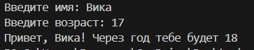

## Задание 2
```
a = input("a: ").replace(',','.')
b = input("b: ").replace(',','.')
a = float(a)
b = float(b)
summa = a + b
avg = summa/2
print(f"sum = {summa:.2f}; avg = {avg:.2f}")
```
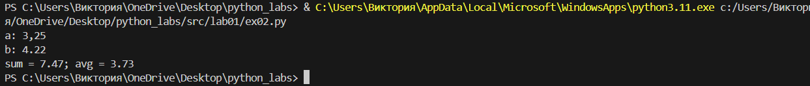

## Задание 3
``` price = float (input("Цена:"))
discount = float (input("скидка %:"))
vat =float (input("НДС%:"))

base = price * (1 - (discount / 100))
vat_amount = base*(vat / 100)
total = base + vat_amount

print(f"База после скидки:{base}")
print(f"НДС:{vat_amount}")
print(f"Итого к оплате:{total}")
```

## Задание 4
```
m = int(input("Минуты :"))
day = m //(60*24)
daymin = m % (60*24)
hour = daymin // 60
minute = daymin % 60
if day > 0:
    print(f"{day}.{hour}.{minute:02d}")
else:
    print(f"{hour}.{minute:02d}")

```
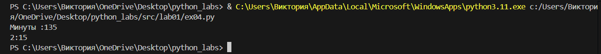

## Задание 5
``` 
inicials = input("ФИО: ")
inicials_clear = " ".join(inicials.split())
words = inicials_clear.split()
iniciali = "".join([word[0].upper() for word in words]) + "."
print(f"ФИО: {inicials}")
print(f"Инициалы: {iniciali}")
print(f"Длина (символов) : {len(inicials_clear)}")

```
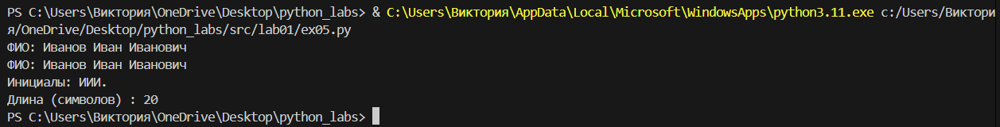

# Лабораторная работа 2
## Задание 1
### max_min
```
nums = [[3, -1, 5, 5, 0],[42],[-5, -2, -9],[],[1.5, 2, 2.0, -3.1]]
def min_max(nums):
    if nums:
        return min(nums), max(nums)
    else:
        return ('ValueError')
for i in nums:
    print(f'{i} -> {min_max(i)}')
 ```
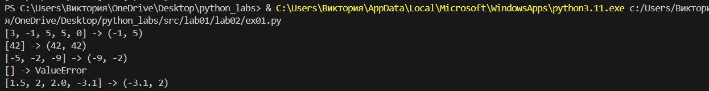

### unique_sorted
```
nums = [[3, 1, 2, 1, 3],[],[-1, -1, 0, 2, 2],[1.0, 1, 2.5, 2.5, 0]]
def unique_sorted(nums):
    if not nums:
        return []
    return sorted(set(nums))
for num in nums:
    print(f'{num} -> {unique_sorted(num)}')
```
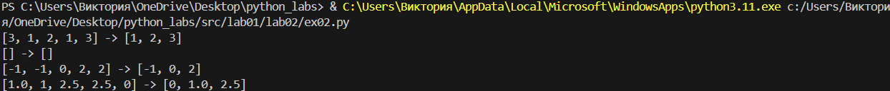
### flatten
```
nums = [[[1, 2], [3, 4]],([1, 2], (3, 4, 5)),[[1], [], [2, 3]],[[1, 2], "ab"]]
def flatten(nums):
    exit_material = []
    for i  in nums:
        if type(i) != str:
            for j in i :
                exit_material.append(j)
        else:
            return 'TypeError'
    return exit_material
for i in nums:
     print(f'{i} -> {flatten(i)}')
```
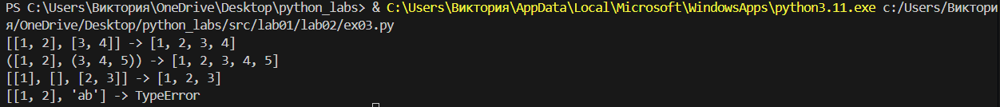

## Задание В
### transpose
```
def transpose(mat: list[list[float | int]]) -> list[list] :
    if not mat:
        return []
    for i in mat :
        if len(i) != len(mat[0]) :
            return 'ValueError'
    str = []
    for i in range(len(mat[0])) :
        A = []
        for j in range(len(mat)):
            A.append(mat[j][i])
        str.append(A)
    return str
print(f'{[1, 2, 3]} -> {transpose([[1, 2, 3]])}') 
print(f'{[1], [2], [3]} -> {transpose([[1], [2], [3]])}')  
print(f'{[[1, 2], [3, 4]]} -> {transpose([[1, 2], [3, 4]])}')  
print(f'{[]} -> {transpose([])}')  
print(f'{[[1, 2], [3]]} -> {transpose([[1, 2], [3]])}') 
```
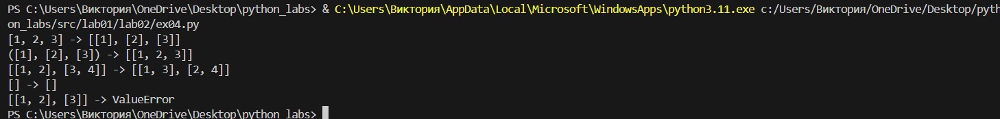
###  row_sums
```
def row_sums(mat: list[list[float | int]]) -> list[float]:
    if not mat:
        return []
    rectangular_matrix = [len(row) for row in mat]
    if len(set(rectangular_matrix)) != 1:
        return 'ValueError'
    summa = [] 
    for row in mat:
        row_sum = sum(row)
        summa.append(row_sum)
    return summa
print(row_sums([[1, 2, 3], [4, 5, 6]]))  
print(row_sums([[-1, 1], [10, -10]]))  
print(row_sums([[0, 0], [0, 0]]))  
print(row_sums([[1, 2], [3]]))
```
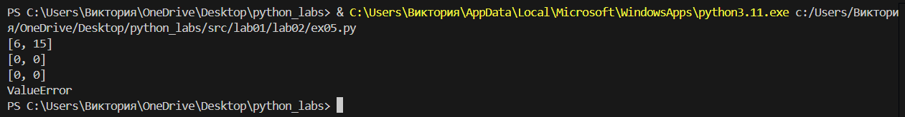
### col_sums
```
def col_sums(mat: list[list[float | int]]) -> list[float]:
    if not mat:
        return [] 
    rectangular_matrix = [len(row) for row in mat]
    if len(set(rectangular_matrix)) != 1:
        return 'ValueError'
    A = len(mat[0])
    summa = []
    for i in range(A):
        i_summa = sum(row[i] for row in mat)
        summa.append(i_summa)
    return summa
print(col_sums([[1, 2, 3], [4, 5, 6]]))  
print(col_sums([[-1, 1], [10, -10]]))  
print(col_sums([[0, 0], [0, 0]]))
print(col_sums([[1, 2], [3]])) 
```
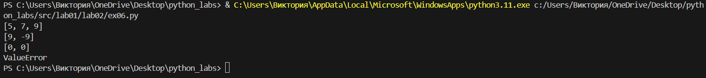
# Лабораторная работа 3
## Задание А
### normalize и tokenize
```
def normalize(text: str, *, casefold: bool = True, yo2e: bool = True) -> str:
    if not text:
        return ''
    for i in '\t\r\n\v\f':
        text = text.replace(i,' ')
    while '  ' in text:
        text = text.replace('  ', ' ')
    text = text.strip()
    if yo2e:
        text = text.replace('ё', 'е').replace('Ё', 'Е')
    if casefold:
        text.casefold()
    return text

def tokenize(text: str) -> list[str]:
    text = normalize(text, casefold=False, yo2e=False)
    words = []
    results = []
    for i in text:
        if i.isalnum() or i == '_' or i == '-' in words:
            words.append(i)
        elif words:
            results.append(''.join(words))
            words = []
    if words:
        results.append(''.join(words))
    return results            
        

test_normalize = "ПрИвЕт\nМИр\t"
test1_normalize = "ёжик, Ёлка"
test2_normalize = "Hello\r\nWorld"
test3_normalize = "  двойные   пробелы  "
test_tokenize = "привет мир"
test2_tokenize = "hello,world!!!"
test3_tokenize = "по-настоящему круто"
test4_tokenize = "2025 год"
test5_tokenize = "emoji 😀 не слово"
print('тест кейсы для normalize:')
print(f"{repr(test_normalize)}, {repr(normalize(test_normalize).casefold())}")
print(f'{repr(test1_normalize)}, {normalize(test1_normalize)}')
print(f'{repr(test2_normalize)}, {normalize(test2_normalize)}')
print(f'{repr(test3_normalize)}, {normalize(test3_normalize)}')

print('тест кейсы для tokenize')
print(f"{repr(test_tokenize)}, {repr(tokenize(test_tokenize))}")
print(f"{repr(test2_tokenize)}, {repr(tokenize(test2_tokenize))}")
print(f"{repr(test3_tokenize)}, {repr(tokenize(test3_tokenize))}")
print(f"{repr(test4_tokenize)}, {repr(tokenize(test4_tokenize))}")
print(f"{repr(test5_tokenize)}, {repr(tokenize(test5_tokenize))}")
```
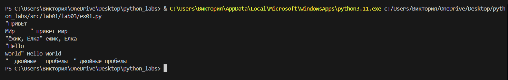
### count_freq + top_n
```
def count_freq(tokens: list[str]) -> dict[str, int]:
    alf = list(sorted(set(tokens)))
    f = {}
    for i in alf:
        f[i] = tokens.count(i)
    return f
def top_n(freq: dict[str, int], n: int = 5) -> list[tuple[str, int]]:
    sort = sorted(freq.items(), key=lambda i: (-i[1], i[0]))
    return sort[:n]
test = 'Токены ["a","b","a","c","b","a"] → частоты {"a":3,"b":2,"c":1};'
test2 = 'токены ["bb","aa","bb","aa","cc"] → частоты {"aa":2,"bb":2,"cc":1}'
print('тест кейсы для count_freq + top_n')
print(f'{repr(test)}; {count_freq(["a","b","a","c","b","a"])} -> {top_n({"a":3,"b":2,"c":1})}')
print(f'{repr(test2)}; {count_freq(["bb","aa","bb","aa","cc"])} -> {top_n({"aa":2,"bb":2,"cc":1})}')
```
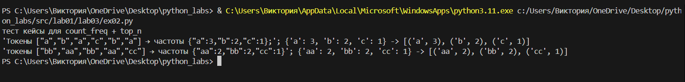

## Задание В
```
import sys
import os
sys.path.append(os.path.join(os.path.dirname(__file__), ".."))
from lyb.text import *

text = "Привет, мир! Привет!!!"
good_text = tokenize(normalize(text))
words = len(good_text)
unique = len(set(good_text)) 
top = top_n(count_freq(good_text))
print(f'Всего слов: {words}')
print(f'Уникальных слов: {unique}')
print('Топ-5:')
for i in top:
    print(f'{i[0]} : {i[1]}')
```
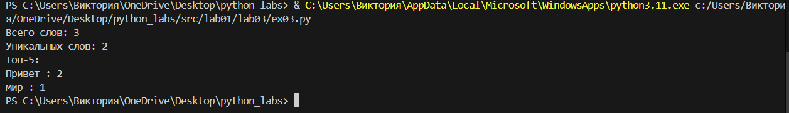

# Лабораторная работа 4
## Задание А
```
import csv
from pathlib import Path
def read_text(path: str | Path, encoding: str = "utf-8") -> str:
    with open(path, 'r', encoding=encoding) as f:
        return f.read()

def write_csv(rows: list[tuple | list], path: str | Path, header: tuple[str, ...] | None = None) -> None:
    if rows and len(set(len(row) for row in rows)) != 1:
        return ValueError
    
    with open(path, 'w', newline='', encoding='utf-8') as f:
        writer = csv.writer(f)
        if header:
            writer.writerow(header)
        writer.writerows(rows)

if __name__ == "__main__":
    try:
        txt = read_text('src\lab01\lab04\data\input.txt')
        print(f"Прочитано: {txt}")
    except FileNotFoundError:
        print("Файл src\lab01\lab04\data\input.txt не найден")
    
    write_csv([("word", "count"), ("test", 3)], "src\lab01\lab04\data\check.csv")  
    print("файл csv создан!")
```
на выходе мы получаем файл csv и :
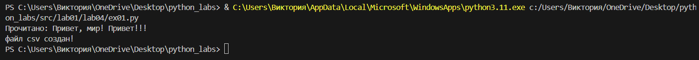

## Задание В
```
import sys
import os
import csv
from collections import Counter

sys.path.insert(0, os.path.join(os.path.dirname(__file__), '..', '..'))

try:
    from lib.text import normalize, tokenize
except ImportError as e:
    sys.exit(f"Ошибка импорта: {e}")

def main():
    input_file = 'src\lab01\lab04\data\input.txt'
    output_file = 'src\lab01\lab04\data\check.csv'

    try:
        with open(input_file, 'r', encoding='utf-8') as f:
            text = f.read()
        if not text.strip():
            sys.exit("Файл пустой")
    except Exception as e:
        sys.exit(f"Ошибка чтения {input_file}: {e}")
    
    try:
        normalized = normalize(text)
        words = tokenize(normalized)
        if not words:
            sys.exit("После обработки слов не найдено")
        word_freq = Counter(words)
    except Exception as e:
        sys.exit(f"Ошибка обработки текста: {e}")


    try:
        os.makedirs(os.path.dirname(output_file), exist_ok=True)
        with open(output_file, 'w', encoding='utf-8', newline='') as f:
            writer = csv.writer(f)
            writer.writerow(['word', 'count'])
            for word, count in sorted(word_freq.items(), key=lambda x: (-x[1], x[0])):
                writer.writerow([word, count])
    except Exception as e:
        sys.exit(f"Ошибка сохранения {output_file}: {e}")
    
    top5 = sorted(word_freq.items(), key=lambda x: (-x[1], x[0]))[:5]
    print(f"Всего слов: {len(words)}")
    print(f"Уникальных слов: {len(word_freq)}")
    print("Чаще всего повторяются:", ', '.join(f"'{w}'({c})" for w, c in top5))

if __name__ == "__main__":
    main()
```


# Лабораторная работа 5
## Задание A — JSON ↔ CSV
### код для задания с примером 1. JSON чтение и запись, примером 2. Работа с CSV
```
import json
import csv
from pathlib import Path

def json_to_csv(json_path: str, csv_path: str) -> None:
    """
    Преобразует JSON-файл в CSV.
    Поддерживает список словарей [{...}, {...}], заполняет отсутствующие поля пустыми строками.
    Кодировка UTF-8. Порядок колонок — алфавитный.
    """
    json_file = Path(json_path)
    with open(json_path, 'r', encoding='utf-8') as json_file : # кодировка UTF-8
        data = json.load(json_file)
    if not json_file.exists():
        raise FileNotFoundError(f"JSON файл отсутствует")
    if not isinstance(data,list):
        raise ValueError('Неверный тип данных')
    if len(data) == 0:
        raise ValueError('Пустой файл JSON')
    all = set()
    for i in data:
        if not isinstance(i,dict):
            raise ValueError('Элементы должны быть словарями')
        all.add(i.keys)
    col = sorted(all)
    
    try:
        with open(csv_path, 'w', encoding='utf-8', newline='') as csv_file:
            csv_file = csv.DictWriter(csv_file, fieldnames=col)
            csv_file.writeheader()
            for i in data:
                row = {r: i.get(r,'') for r in col}
                csv_file.writerow(row)
    except Exception as ex:
        raise ValueError(f'Ошибка при записи CSV: {ex}')
    
def csv_to_json(csv_path: str, json_path: str) -> None:
    """
    Преобразует CSV в JSON (список словарей).
    Заголовок обязателен, значения сохраняются как строки.
    json.dump(..., ensure_ascii=False, indent=2)
    """
    csv_file = Path(csv_path)
    if not csv_file.exists():
        raise FileNotFoundError(f'Файл CSV не найден')
    with open(csv_path, 'r', encoding = 'utf-8') as csv_file:
        line = csv_file.readline()
        if not csv_file.strip():
            raise FileNotFoundError(f'Файл CSV пустой')
        reader = csv.DictReader(csv_file)
        if reader.fieldnames == None:
            raise ValueError(f'Файл CSV не содержит заголовков')
        
        data = []
        for row in reader:
            string_row = {}
            for key, value in row.items():
                string_row[key] = str(value)
            data.append(string_row)
            
        if len(data) == 0:
            raise ValueError(f'CSV файл не содержит данных, имеет только заголовки')
    # запись JSON
    try:
        with open(json_path, 'w', encoding='utf-8') as json_file:
            json.dump(data, json_file, ensure_ascii=False, indent=2) #запись данных в JSON формат (data =данные, json_file = файл куда идет запись
            #ensure_ascii=False - разрешение русских букв (без \u0430\u0431), indent=2 - красивое форматирование с отступами )
    except Exception as ex:
        raise ValueError(f'Ошибка при записи JSON')
    

data = [{"name": "Alice", "age": 22}, {"name": "Bob", "age": 25}]
path = Path("src.data/out/people.json")
path.parent.mkdir(parents=True, exist_ok=True)

with path.open("w", encoding="utf-8") as f:
    json.dump(data, f, ensure_ascii=False, indent=2)

with path.open(encoding="utf-8") as f:
    loaded_data = json.load(f)
print(loaded_data)

rows = [
    {"name": "Alice", "age": "22", "city": "SPB"},
    {"name": "Bob", "age": "25", "city": "Moscow"}
]
with open("src.data/out/people.csv", "w", newline="", encoding="utf-8") as f:
    writer = csv.DictWriter(f, fieldnames=["name", "age", "city"])  
    writer.writeheader()  
    writer.writerows(rows)  
with open("src.data/out/people.csv", encoding="utf-8") as f:
    reader = csv.DictReader(f)  
    for row in reader:
        print(row)
```
### при выполнении этого кода создается файл JSON и CSV
#### JSON
 
#### CSV
 
## Задание B — CSV → XLSX
### код для задания с примером 3. CSV → XLSX через openpyxl
```
import csv
from pathlib import Path
import openpyxl
from openpyxl.utils import get_column_letter
from openpyxl import Workbook
import csv

def csv_to_xlsx(csv_path: str, xlsx_path: str) -> None:
    """
    Конвертирует CSV в XLSX.
    Использовать openpyxl ИЛИ xlsxwriter.
    Первая строка CSV — заголовок.
    Лист называется "Sheet1".
    Колонки — автоширина по длине текста (не менее 8 символов).
    """
    csv_file = Path(csv_path)
    if not csv_file.exists():
        raise FileNotFoundError(f'CSV файл не найден')
    if not csv_path.lower().endswith('.csv'):
        raise ValueError(f'Файл должен иметь расширение csv')
    try:
        with open(csv_path, 'r', encoding='utf-8') as csv_file:
            line = csv_file.readline()
            if not line.strip():
                raise ValueError('Пустой CSV файл')
            reader = csv.reader(csv_file)
            data = list(reader)
    except UnicodeDecodeError:
        raise ValueError(f'неправильная кодировка (должна быть UTF-8)')
    except csv.Error:
        raise ValueError(f'неправильный формат CSV файла')
    except Exception as ex:
        raise ValueError(f'Ошибка при чтении файла CSV: {ex}')
    
    if len(data) == 0:
        raise ValueError("CSV файл не содержит данных")
    if len(data) < 1:
        raise ValueError("CSV файл не содержит заголовки")
    
    try:
        work = openpyxl.Workbook()
        sheet = work.active
        title = 'Sheet1'
        for row_idx, row_data in enumerate(data, 1):
            for col_idx, cell_value in enumerate(row_data, 1):
                sheet.cell(row=row_idx, column=col_idx, value=cell_value)
        for col_idx in range(1, len(data[0]) + 1):
            column_letter = get_column_letter(col_idx)
            max_length = 8  # минимальная ширина колонок
            for row in sheet[column_letter]:
                if row.value:
                    max_length = max(max_length, len(str(row.value)))
            sheet.column_dimensions[column_letter].width = max_length + 2 # добавление отступов
        work.save(xlsx_path)
    except Exception as ex:
        raise ValueError(f"Ошибка при создании XLSX файла: {ex}")

wb = Workbook()
ws = wb.active
ws.title = "Sheet1"
output_dir = Path("src/data/out")
output_dir.mkdir(parents=True, exist_ok=True)  

with open("src/data/samples/people.csv", encoding="utf-8") as f:
    reader = csv.reader(f)  
    for row in reader:      
        ws.append(row)      

wb.save("src/data/out/people.xlsx")  
csv_to_xlsx("src/data/samples/people.csv", "src/data/out/people.xlsx") 
```
### при выполнении этого кода создается файл XLSX из формата CSV

