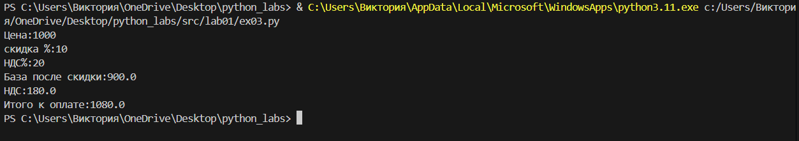

# python_labs
## Задание 1
```
name = input(f'Введите имя:')
age = int(input(f'Введите возраст:'))
print(f'Привет,{name}! Через год тебе будет {age + 1}' )
```


## Задание 2
```
a = input("a: ").replace(',','.')
b = input("b: ").replace(',','.')
a = float(a)
b = float(b)
summa = a + b
avg = summa/2
print(f"sum = {summa:.2f}; avg = {avg:.2f}")
```


## Задание 3
``` price = float (input("Цена:"))
discount = float (input("скидка %:"))
vat =float (input("НДС%:"))

base = price * (1 - (discount / 100))
vat_amount = base*(vat / 100)
total = base + vat_amount

print(f"База после скидки:{base}")
print(f"НДС:{vat_amount}")
print(f"Итого к оплате:{total}")
```

## Задание 4
```
m = int(input("Минуты :"))
day = m //(60*24)
daymin = m % (60*24)
hour = daymin // 60
minute = daymin % 60
if day > 0:
    print(f"{day}.{hour}.{minute:02d}")
else:
    print(f"{hour}.{minute:02d}")

```


## Задание 5
``` 
inicials = input("ФИО: ")
inicials_clear = " ".join(inicials.split())
words = inicials_clear.split()
iniciali = "".join([word[0].upper() for word in words]) + "."
print(f"ФИО: {inicials}")
print(f"Инициалы: {iniciali}")
print(f"Длина (символов) : {len(inicials_clear)}")

```


# Лабораторная работа 2
## Задание 1
### max_min
```
nums = [[3, -1, 5, 5, 0],[42],[-5, -2, -9],[],[1.5, 2, 2.0, -3.1]]
def min_max(nums):
    if nums:
        return min(nums), max(nums)
    else:
        return ('ValueError')
for i in nums:
    print(f'{i} -> {min_max(i)}')
 ```


### unique_sorted
```
nums = [[3, 1, 2, 1, 3],[],[-1, -1, 0, 2, 2],[1.0, 1, 2.5, 2.5, 0]]
def unique_sorted(nums):
    if not nums:
        return []
    return sorted(set(nums))
for num in nums:
    print(f'{num} -> {unique_sorted(num)}')
```

### flatten
```
nums = [[[1, 2], [3, 4]],([1, 2], (3, 4, 5)),[[1], [], [2, 3]],[[1, 2], "ab"]]
def flatten(nums):
    exit_material = []
    for i  in nums:
        if type(i) != str:
            for j in i :
                exit_material.append(j)
        else:
            return 'TypeError'
    return exit_material
for i in nums:
     print(f'{i} -> {flatten(i)}')
```


## Задание В
### transpose
```
def transpose(mat: list[list[float | int]]) -> list[list] :
    if not mat:
        return []
    for i in mat :
        if len(i) != len(mat[0]) :
            return 'ValueError'
    str = []
    for i in range(len(mat[0])) :
        A = []
        for j in range(len(mat)):
            A.append(mat[j][i])
        str.append(A)
    return str
print(f'{[1, 2, 3]} -> {transpose([[1, 2, 3]])}') 
print(f'{[1], [2], [3]} -> {transpose([[1], [2], [3]])}')  
print(f'{[[1, 2], [3, 4]]} -> {transpose([[1, 2], [3, 4]])}')  
print(f'{[]} -> {transpose([])}')  
print(f'{[[1, 2], [3]]} -> {transpose([[1, 2], [3]])}') 
```

###  row_sums
```
def row_sums(mat: list[list[float | int]]) -> list[float]:
    if not mat:
        return []
    rectangular_matrix = [len(row) for row in mat]
    if len(set(rectangular_matrix)) != 1:
        return 'ValueError'
    summa = [] 
    for row in mat:
        row_sum = sum(row)
        summa.append(row_sum)
    return summa
print(row_sums([[1, 2, 3], [4, 5, 6]]))  
print(row_sums([[-1, 1], [10, -10]]))  
print(row_sums([[0, 0], [0, 0]]))  
print(row_sums([[1, 2], [3]]))
```

### col_sums
```
def col_sums(mat: list[list[float | int]]) -> list[float]:
    if not mat:
        return [] 
    rectangular_matrix = [len(row) for row in mat]
    if len(set(rectangular_matrix)) != 1:
        return 'ValueError'
    A = len(mat[0])
    summa = []
    for i in range(A):
        i_summa = sum(row[i] for row in mat)
        summa.append(i_summa)
    return summa
print(col_sums([[1, 2, 3], [4, 5, 6]]))  
print(col_sums([[-1, 1], [10, -10]]))  
print(col_sums([[0, 0], [0, 0]]))
print(col_sums([[1, 2], [3]])) 
```

# Лабораторная работа 3
## Задание А
### normalize и tokenize
```
def normalize(text: str, *, casefold: bool = True, yo2e: bool = True) -> str:
    if not text:
        return ''
    for i in '\t\r\n\v\f':
        text = text.replace(i,' ')
    while '  ' in text:
        text = text.replace('  ', ' ')
    text = text.strip()
    if yo2e:
        text = text.replace('ё', 'е').replace('Ё', 'Е')
    if casefold:
        text.casefold()
    return text

def tokenize(text: str) -> list[str]:
    text = normalize(text, casefold=False, yo2e=False)
    words = []
    results = []
    for i in text:
        if i.isalnum() or i == '_' or i == '-' in words:
            words.append(i)
        elif words:
            results.append(''.join(words))
            words = []
    if words:
        results.append(''.join(words))
    return results            
        

test_normalize = "ПрИвЕт\nМИр\t"
test1_normalize = "ёжик, Ёлка"
test2_normalize = "Hello\r\nWorld"
test3_normalize = "  двойные   пробелы  "
test_tokenize = "привет мир"
test2_tokenize = "hello,world!!!"
test3_tokenize = "по-настоящему круто"
test4_tokenize = "2025 год"
test5_tokenize = "emoji 😀 не слово"
print('тест кейсы для normalize:')
print(f"{repr(test_normalize)}, {repr(normalize(test_normalize).casefold())}")
print(f'{repr(test1_normalize)}, {normalize(test1_normalize)}')
print(f'{repr(test2_normalize)}, {normalize(test2_normalize)}')
print(f'{repr(test3_normalize)}, {normalize(test3_normalize)}')

print('тест кейсы для tokenize')
print(f"{repr(test_tokenize)}, {repr(tokenize(test_tokenize))}")
print(f"{repr(test2_tokenize)}, {repr(tokenize(test2_tokenize))}")
print(f"{repr(test3_tokenize)}, {repr(tokenize(test3_tokenize))}")
print(f"{repr(test4_tokenize)}, {repr(tokenize(test4_tokenize))}")
print(f"{repr(test5_tokenize)}, {repr(tokenize(test5_tokenize))}")
```

### count_freq + top_n
```
def count_freq(tokens: list[str]) -> dict[str, int]:
    alf = list(sorted(set(tokens)))
    f = {}
    for i in alf:
        f[i] = tokens.count(i)
    return f
def top_n(freq: dict[str, int], n: int = 5) -> list[tuple[str, int]]:
    sort = sorted(freq.items(), key=lambda i: (-i[1], i[0]))
    return sort[:n]
test = 'Токены ["a","b","a","c","b","a"] → частоты {"a":3,"b":2,"c":1};'
test2 = 'токены ["bb","aa","bb","aa","cc"] → частоты {"aa":2,"bb":2,"cc":1}'
print('тест кейсы для count_freq + top_n')
print(f'{repr(test)}; {count_freq(["a","b","a","c","b","a"])} -> {top_n({"a":3,"b":2,"c":1})}')
print(f'{repr(test2)}; {count_freq(["bb","aa","bb","aa","cc"])} -> {top_n({"aa":2,"bb":2,"cc":1})}')
```
