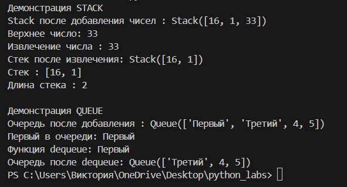
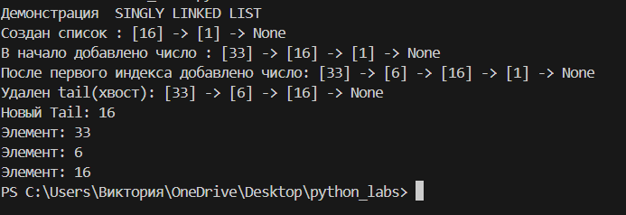

# Последняя лабораторная работа № 10
## Чуть теории

### Стек (Stack)
**Принцип:** LIFO (Last In, First Out) — последним пришел, первым ушел.  **В Стеке** элемент, который добавили последним, будет обработан первым. 

### Очередь (Queue)
**Принцип:** FIFO (First In, First Out) — первым пришел, первым ушел. **В Очереди** элемент, который пришел первым, будет обработан первым.


### Связный список (Linked List)
**Принцип:** Набор узлов, где каждый хранит значение и ссылку на следующий узел.

### Где используются эти структуры в реальности?
#### Stack:

* *(Ctrl+Z):* Отмена действий в редакторах (хранится история изменений).

* *Браузер:* Кнопка "Назад" (история посещенных страниц).
#### Queue:
* *Принтер:* Документы печатаются в порядке поступления.

* *Веб-серверы:* Обработка запросов пользователей по очереди.

* *Плееры:* Очередь воспроизведения песен.

#### Связный список (Linked List):
* *Файловые системы:* Файл на диске может быть разбит на куски, связанные ссылками.
* *Реализация Стеков и Очередей:* Часто внутри они устроены именно как списки (для бесконечного добавления элементов без перевыделения памяти).

## Решение для задания А: class stack и class queue

**Код:**
```
from collections import queue

class Stack:
    def __init__(self):
        self._data: list[any] = []
        
    def push(self, item: any) -> None:
        self._data.append(item)
    
    def pop(self) -> any:
        if self.is_empty():
            raise IndexError("pop from 'пустой' stack")
        return self._data.pop()
    
    def peek(self):
        if not self._data:
            return None
        return self._data[-1] # первый элемент без удаления
    
    def is_empty(self) -> bool:
        return len(self._data) == 0
    
    def __len__(self) -> int:
        return len(self._data)
    
    def __repr__(self):
        return f"Stack({self._data})" # Превращаем список в строку вида "Stack([1, 2, 3])"
    
class Queue:
    def __init__(self):
        self._data: deque[any] = deque()

    def enqueue(self, item: any) -> None:
        self._data.append(item) #добавление элемента в конец очереди

    def dequeue(self) -> any:
        if self.is_empty():
            raise IndexError("dequeue from empty queue")
        return self._data.popleft() #взять элемент из начала очереди

    def peek(self):
        if not self._data:
            return None
        return self._data[0]

    def is_empty(self) -> bool:
        return len(self._data) == 0

    def __len__(self) -> int:
        return len(self._data)
    
    def __repr__(self):
        return f"Queue({list(self._data)})" # Превращаем dequeue в обычный список для красивого вывода

if __name__ == "__main__":
    print("Демонстрация STACK")
    stack = Stack()
    stack.push(16)
    stack.push(1)
    stack.push(33)
    print(f"Stack после добавления чисел : {stack}")
    print(f"Верхнее число: {stack.peek()}")
    print(f"Извлечение числа : {stack.pop()}")
    print(f"Стек после извлечения: {stack}")
    print(f'Стек : {stack._data}')
    print(f"Длина стека : {len(stack)}")
    print("                                ")
    print("Демонстрация QUEUE")
    queue = Queue()
    queue.enqueue("Первый")
    queue.enqueue("Третий")
    queue.enqueue(4)
    queue.enqueue(5)
    print(f"Очередь после добавления : {queue}")
    first = queue.peek()
    print(f"Первый в очереди: {first}")
    dequeued = queue.dequeue()
    print(f"Функция dequeue: {dequeued}")
    print(f"Очередь после dequeue: {queue}")
```


## Задание B 
``` from typing import Any, Optional, Iterator
class Node:
    def __init__(self, value: Any):
        self.value = value # Запоминаем данные
        self.next: Optional['Node'] = None # Указатель на следующий узел

class SinglyLinkedList:
    def __init__(self, iterable=None):
        self.head: Optional[Node] = None # Указатель на начало (голову) 
        self.tail: Optional[Node] = None # Указатель на конец (хвост)
        self._size: int = 0
        if iterable:
            for item in iterable:
                self.append(item)
                
    def append(self, value): # добавление элемента в конец списка
        new_node = Node(value)
        
        if self.head is None: # Проверка на пустой список
            self.head = new_node
            self._tail = new_node
        else:
            self._tail.next = new_node
            self._tail = new_node
        self._size += 1
        
    def prepend(self, value: Any) -> None: # Добавление элемента в начало списка
        new_node = Node(value)
        new_node.next = self.head
        self.head = new_node
        
        if self._size == 0:
            self.tail = new_node
        self._size += 1
    
    def insert(self, idx: int, value: Any) -> None:
        if idx < 0 or idx > self._size:
            raise IndexError("Индекс выходит за пределы допустимого диапазона")
        if idx == 0:
            self.prepend(value)
            return
        if idx == self._size:
            self.append(value)
            return
        
        current = self.head
        for _ in range(idx - 1):
            current = current.next
        new_node = Node(value)
        new_node.next = current.next
        current.next = new_node
        self._size += 1
    def remove(self, value: Any) -> None: # Удаление первого вхождения значения value.
        if not self.head:
            raise ValueError(f"{value} not in list")

        # Случай 1 : удаление головы
        if self.head.value == value:
            self.head = self.head.next
            self._size -= 1
            if self._size == 0:
                self.tail = None
            return
        # Случай 2 : Удаление из середины или конца
        current = self.head
        while current.next:
            if current.next.value == value:
                current.next = current.next.next
                if current.next is None: # обновление tail, если удален последний элемент
                    self.tail = current
                self._size -= 1
                return
            current = current.next
        raise ValueError(f"{value} not in list")
    def __iter__(self) -> Iterator[Any]:
        current = self.head
        while current:
            yield current.value
            current = current.next

    def __len__(self) -> int:
        return self._size
    
    def __repr__(self) -> str: # Красивый вывод: [A] -> [B] -> [C] -> None
        parts = []
        current = self.head
        while current:
            parts.append(f"[{current.value}]")
            current = current.next
        parts.append("None")
        return " -> ".join(parts)
    
if __name__ == "__main__":
    print("Демонстрация  SINGLY LINKED LIST")
    sll = SinglyLinkedList()
    sll.append(16)
    sll.append(1)
    print(f"Создан список : {sll}")
    sll.prepend(33)
    print(f"В начало добавлено число : {sll}")
    sll.insert(1,6)
    print(f"После первого индекса добавлено число: {sll}")
    sll.remove(1) 
    print(f"Удален tail(хвост): {sll}")
    print(f"Новый Tail: {sll.tail.value if sll.tail else 'None'}")
    for i in sll:
        print(f"Элемент: {i}")
```


# СПАСИБО ЗА КУРС